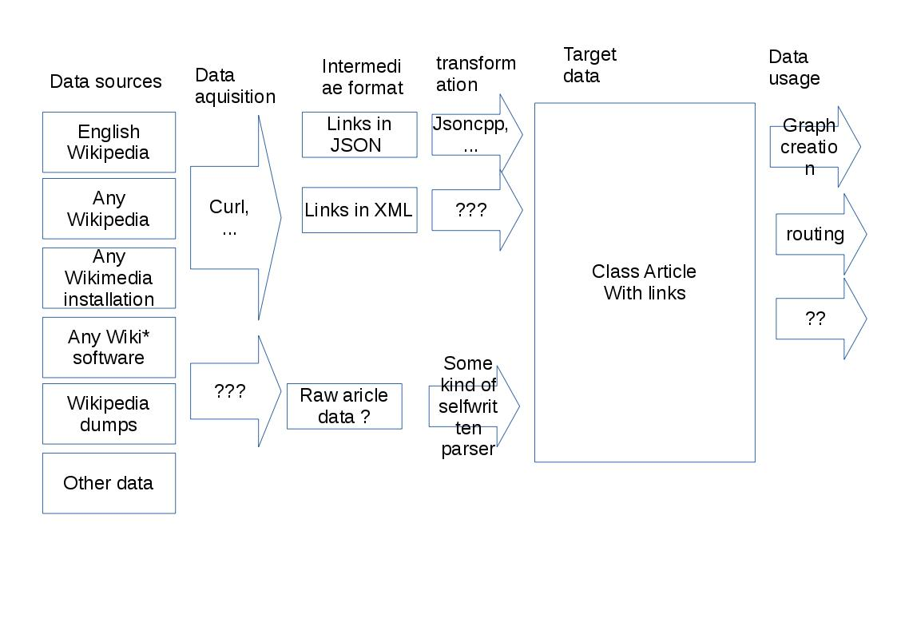

# Main idea

Given a Wikipedia Article URL, scan the article and follow all encountered article links,
repeat the proccess recursively to a certain depth.

In the end, we have a graph of articles.

Links to other articles should always be scanned, but these articles themselves shouldn't neccessarily.

# Thoughts

I'm not sure whether this "Walker" class is such a good idea.
It was intended as a starting point and have the responsibility of getting links of articles within the article.

But as it is designed now, there would be one global Walker for the program (since the walker holds th article collection).
But a walker would also need to walk through other articles recursively...

Thus, it might not be such a good idea...

# Design

An *article* consists of of title and a collection of other articles it links to.

All articles must also reside in a "global" collection (which might be in *another class*).
A) This is to avoid creating infinite articles because of multiple links (i.e. article A -> B, B -> C, A -> C).
B) Also, there might be cyclic links (i.e. article A links to B, B -> C, C -> D and D -> A).
Using this global collection one could look up if the article instance already exists.

I'm not really happy with the C pointers, regarding resource cleanup.
I need to avoid double freeing in case A.
Using only shared pointers is not possible because of B.

Another class should be responsible for parsing the article. This parser could either add linked articles
to the article itself, or simply return a collection. This is because the result of the parser needs to be
parsed again.

## on data storage

<table><tbody><tr><td></td><td></td><td></td><td colspan="6">
Article links to other articles
</td></tr><tr><td></td><td></td><td></td><td>
unique_ptr
</td><td>
shared_ptr
</td><td>
weak_ptr
</td><td>
raw pointer
</td><td>
reference
</td><td>
object
</td></tr><tr><td></td><td></td><td></td><td>
(1)
</td><td>
(5)
</td><td></td><td></td><td>
(2)
</td><td>
(3)
</td></tr><tr><td rowspan="6">
Article map contents
</td><td>
unique_ptr
</td><td>
(6)
</td><td>
X
</td><td>
X
</td><td>
X
</td><td>
X
</td><td>
X
</td><td>
X
</td></tr><tr><td>
shared_ptr
</td><td></td><td>
X
</td><td>
X
</td><td>
(9)
</td><td>
(10)
</td><td>
X
</td><td>
X
</td></tr><tr><td>
weak_ptr
</td><td></td><td>
X
</td><td>
X
</td><td>
X (7)
</td><td>
X (8)
</td><td>
X
</td><td>
X
</td></tr><tr><td>
raw pointer
</td><td></td><td>
X
</td><td>
X
</td><td>
X (8)
</td><td>
Current implementation
</td><td>
X
</td><td>
X
</td></tr><tr><td>
reference
</td><td>
(2)
</td><td>
X
</td><td>
X
</td><td>
X
</td><td>
X
</td><td>
X
</td><td>
X
</td></tr><tr><td>
object
</td><td>
(4)
</td><td>
X
</td><td>
X
</td><td>
X
</td><td>
X
</td><td>
X
</td><td>
X
</td></tr></tbody></table>

X = no

 - (1) obviously, no, since multiple articles can link to the same one
 - (2) STL containers can't save references
 - (3) doesn't make sense, see (1)
 - (4) would be nice, but objects here could move, and invalidate pointers
 - (5) Articles could have cyclic references, STL is not clever enough to detect this
 - (6) won't be unique, articles link among themselves
 - (7) only weak pointers doesn't make much sense. also, we need at least 1 shared
 - (8) combination doesn't make sense

Maybe:

 - (9) What is the run time penalty for locking a weak_ptr to a shared_ptr?
 - (10) Weeelll.. theoretically, this looks like a bad idea, since as soon as the ArticleCollection
   is gone, all raw pointers in Article are invalid. But on the other hand: by my current
   program design, the Articles (with their raw pointers to other articles) won't outlive
   the ArticleCollection. As soon as the ArticleCollection is "dead", all Articles are as well.
   Might be the same scennario as (9), only I won't need the penalty (?) of locking the weak_ptrs.
   This would be really preferrable to the current implementation (with manual cleanup).

# TODO

 - [ ] get unit tests to work without manually specifying .o files
 - [ ] Support multiple wikipedias
 - [ ] support other Wikimedia installations+
 - [ ] support local wikipedia dump
 - [ ] support output formats (dot, etc?)
 - [ ] support "routing"?
